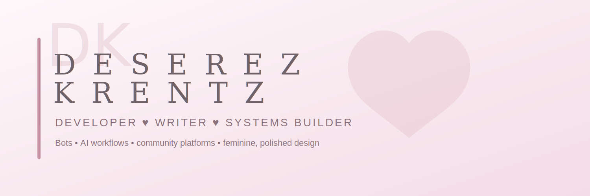

  

<h1 align="center">✨ Deserez Krentz ✨</h1>

Developer ♥ Writer ♥ Systems Builder

Building creative systems, bots, and tools that bring communities and ideas to life.

---

## 💗 About Me

I design and build **interactive systems, bots, and community platforms** with a focus on creativity, usability, and storytelling.

For over a decade I’ve been combining:

- technical development
- creative writing
- world‑building
- user‑focused design

to create experiences that feel **alive and immersive**.

Currently building:

- ⚙️ **Fisto Unit** – Fallout-inspired Discord RPG bot  
- 🧠 **Hashirama** – AI-style handbook assistant for the Nindo RP community  
- 🌙 **Lunaria** – period, fertility, and pregnancy tracking app  
- 🎨 **Custom community platforms** and forum systems  

---

## 🧰 Tech & Tools

💻 **Languages**  
HTML • CSS • JavaScript • Node.js  

🤖 **Bots & Systems**  
Discord.js • AI chatbot evaluation • prompt engineering  

🗄 **Data & Backend**  
SQLite • database systems • automation  

🎨 **Creative / Design**  
UI thinking • community platform design • worldbuilding • technical writing  

---

## 🚀 Featured Projects

### ⚙️ Fisto Unit
A **Fallout-inspired Discord RPG bot** featuring:

- inventory systems
- caps economy
- perks
- shops
- raids
- player progression

Built using **Node.js, Discord.js, and SQLite**.

---

### 🧠 Hashirama

An **AI-style assistant bot** designed to guide players through the Naruto Nindo roleplay system.

Focus areas:

- rule interpretation
- handbook guidance
- lore lookup
- conversational support

---

### 🌙 Lunaria

A **cycle, fertility, and pregnancy tracking application** focused on:

- thoughtful design
- feminine UX
- modern health tools
- supportive user experience

Currently in development.

---

## 🌸 What I'm Interested In

- AI training & chatbot evaluation  
- prompt engineering  
- bot ecosystems  
- interactive communities  
- creative technology  

---

## 📫 Connect

💌 **Email:**  
deserezkrentz999@outlook.com

---

  <i>Soft tech ♥ strong systems ♥ creative builds</i>

